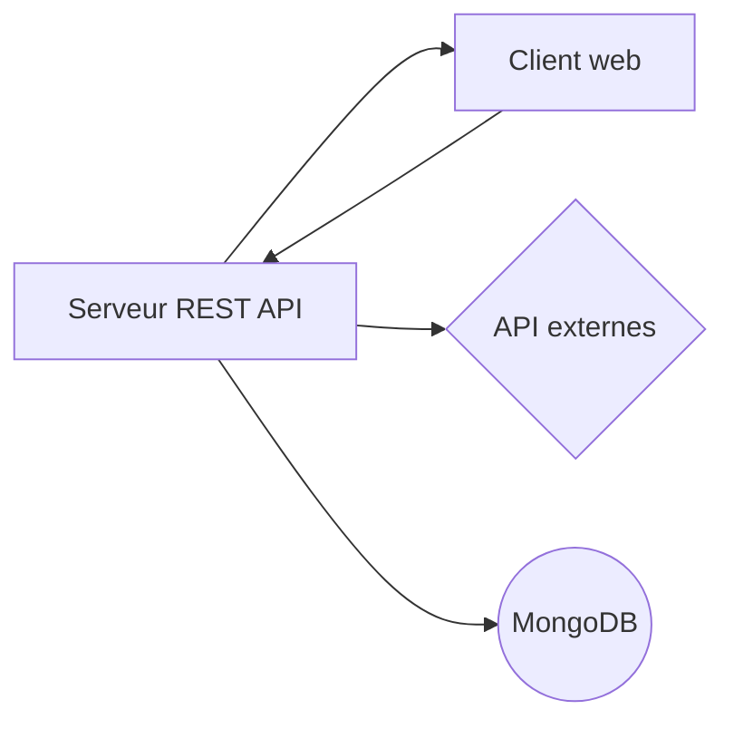
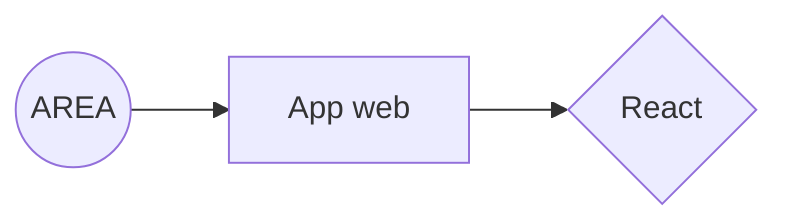
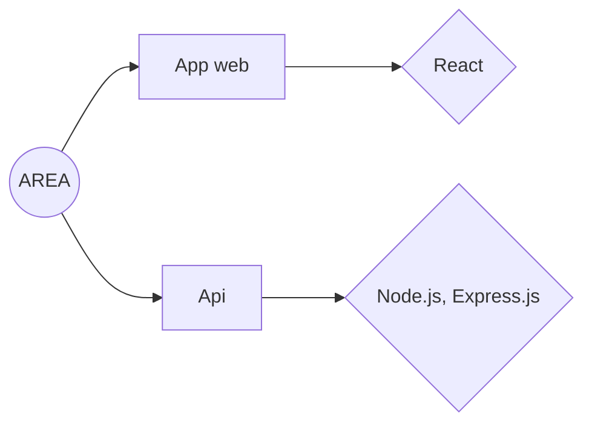

# Action REAction (AREA)
Dans le cadre de notre 3ème année l'AREA est un projet Epitech compris dans le module de développement web.

## SOMMAIRE
- **Information général**
- **Environnement général**
 - **Graphique technique**

## INFORMATION GÉNÉRAL

- **Taille du groupe** : 1
- **Répertoire** : B-YEP-500-LIL-5-1-area-theo.selosse
 - **Langage** : Node.js, Express.js, React.js
 - **Compilation** : docker-compose build && docker-compose up

## ENVIRONNEMENT GÉNÉRAL

- **Environnement technique** :

## GRAPHIQUE TECHNIQUE

### Front

### Back

# Installation
- Prérequis.
  > Docker

- Etape 1.
  > docker-compose up && docker-compose build